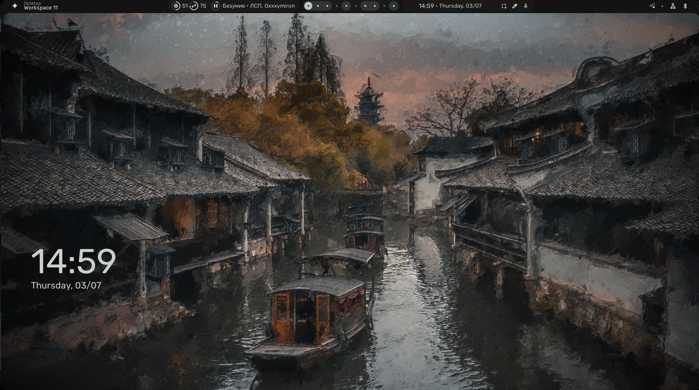

# My linux config

## Download yay
```
sudo pacman -Suy
```
```
git clone https://aur.archlinux.org/yay.git
```
```
cd yay
```
```
makepkg -si
```
## Install fish as default shell
```
yay -S fish
```
```
chsh -s /usr/local/bin/fish
```
## Install requirements
```
yay -s git go google-chrome zen-browser-bin nodejs firefox code zed hyprlock hyprpicker neovim grim slurp swww light swaylock-effects-git swayidle nwg-look playerctl pamixer cava neofetch file-roller thunar thunar-archive-plugin nerd-fonts matugen morewaita-icon-theme networkmanager bluez bluez-utils blueman waypaper orchis-theme
```
## Create ags bar
```
yay -S libastal-meta aylurs-gtk-shell-git
```
```
ags types
```
## Clone this repo
```
rm -rf ~/.config
git https://github.com/yosheeeee/hyprconfigs.git ~/.config
```
## Set Autologin
### Install GDM
```
yay -S gdm
sudo systemctl enable gdm.service -f
```
### Set autologin to user
#### in /etc/gdm/custom.conf add
```
[daemon]
AutomaticLoginEnable=True
AutomaticLogin=yoshee
```
